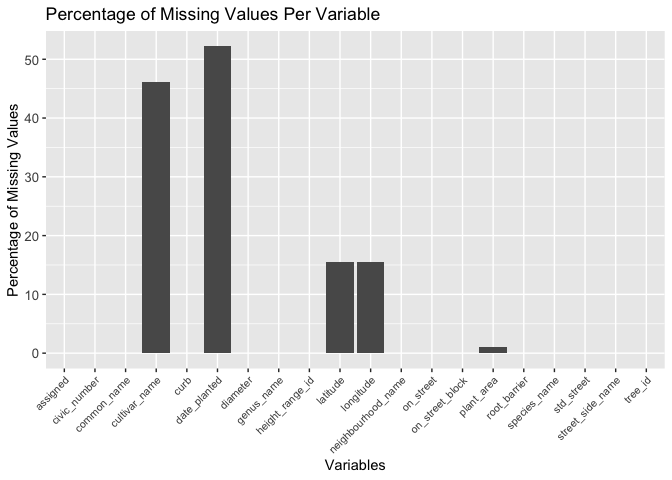
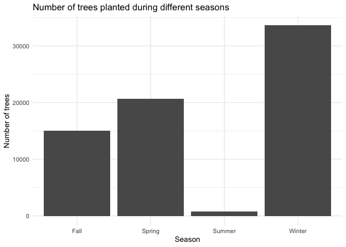
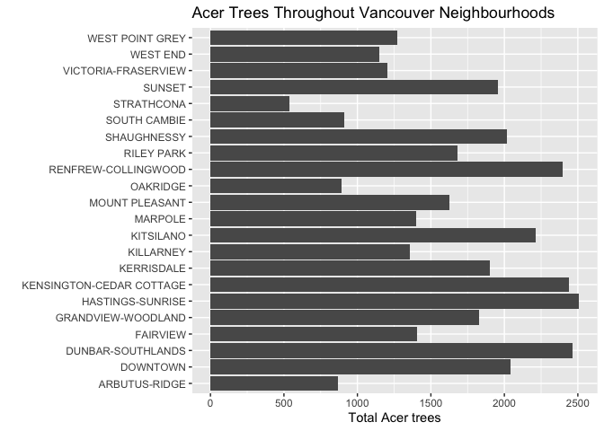

# Mini Data-Analysis (STAT545A)

# Welcome to your (maybe) first-ever data analysis project!

And hopefully the first of many. Let’s get started:

1.  Install the [`datateachr`](https://github.com/UBC-MDS/datateachr)
    package by typing the following into your **R terminal**:

          #remove the hashtag ('#') symbol before the lines of code you wish to run below:
          #install.packages("devtools")
          #devtools::install_github("UBC-MDS/datateachr")

2.  Load the packages below.

        library(datateachr)
        library(tidyverse)

        ## ── Attaching core tidyverse packages ──────────────────────── tidyverse 2.0.0 ──
        ## ✔ dplyr     1.1.3     ✔ readr     2.1.4
        ## ✔ forcats   1.0.0     ✔ stringr   1.5.0
        ## ✔ ggplot2   3.4.2     ✔ tibble    3.2.1
        ## ✔ lubridate 1.9.2     ✔ tidyr     1.3.0
        ## ✔ purrr     1.0.1     
        ## ── Conflicts ────────────────────────────────────────── tidyverse_conflicts() ──
        ## ✖ dplyr::filter() masks stats::filter()
        ## ✖ dplyr::lag()    masks stats::lag()
        ## ℹ Use the conflicted package (<http://conflicted.r-lib.org/>) to force all conflicts to become errors

3.  Make a repository in the <https://github.com/stat545ubc-2023>
    Organization. You can do this by following the steps found on canvas
    in the entry called [MDA: Create a
    repository](https://canvas.ubc.ca/courses/126199/pages/mda-create-a-repository).
    One completed, your repository should automatically be listed as
    part of the stat545ubc-2023 Organization.

# Instructions

## For Both Milestones

-   Each milestone has explicit tasks. Tasks that are more challenging
    will often be allocated more points.

-   Each milestone will be also graded for reproducibility, cleanliness,
    and coherence of the overall Github submission.

-   While the two milestones will be submitted as independent
    deliverables, the analysis itself is a continuum - think of it as
    two chapters to a story. Each chapter, or in this case, portion of
    your analysis, should be easily followed through by someone
    unfamiliar with the content.
    [Here](https://swcarpentry.github.io/r-novice-inflammation/06-best-practices-R/)
    is a good resource for what constitutes “good code”. Learning good
    coding practices early in your career will save you hassle later on!

-   The milestones will be equally weighted.

## For Milestone 1

**To complete this milestone**, edit [this very `.Rmd`
file](https://raw.githubusercontent.com/UBC-STAT/stat545.stat.ubc.ca/master/content/mini-project/mini-project-1.Rmd)
directly. Fill in the sections that are tagged with
`<!--- start your work below --->`.

**To submit this milestone**, make sure to knit this `.Rmd` file to an
`.md` file by changing the YAML output settings from
`output: html_document` to `output: github_document`. Commit and push
all of your work to the mini-analysis GitHub repository you made
earlier, and tag a release on GitHub. Then, submit a link to your tagged
release on canvas.

**Points**: This milestone is worth 36 points: 30 for your analysis, and
6 for overall reproducibility, cleanliness, and coherence of the Github
submission.

# Learning Objectives

By the end of this milestone, you should:

-   Become familiar with your dataset of choosing
-   Select 4 questions that you would like to answer with your data
-   Generate a reproducible and clear report using R Markdown
-   Become familiar with manipulating and summarizing your data in
    tibbles using `dplyr`, with a research question in mind.

# Task 1: Choose your favorite dataset

The `datateachr` package by Hayley Boyce and Jordan Bourak currently
composed of 7 semi-tidy datasets for educational purposes. Here is a
brief description of each dataset:

-   *apt\_buildings*: Acquired courtesy of The City of Toronto’s Open
    Data Portal. It currently has 3455 rows and 37 columns.

-   *building\_permits*: Acquired courtesy of The City of Vancouver’s
    Open Data Portal. It currently has 20680 rows and 14 columns.

-   *cancer\_sample*: Acquired courtesy of UCI Machine Learning
    Repository. It currently has 569 rows and 32 columns.

-   *flow\_sample*: Acquired courtesy of The Government of Canada’s
    Historical Hydrometric Database. It currently has 218 rows and 7
    columns.

-   *parking\_meters*: Acquired courtesy of The City of Vancouver’s Open
    Data Portal. It currently has 10032 rows and 22 columns.

-   *steam\_games*: Acquired courtesy of Kaggle. It currently has 40833
    rows and 21 columns.

-   *vancouver\_trees*: Acquired courtesy of The City of Vancouver’s
    Open Data Portal. It currently has 146611 rows and 20 columns.

**Things to keep in mind**

-   We hope that this project will serve as practice for carrying our
    your own *independent* data analysis. Remember to comment your code,
    be explicit about what you are doing, and write notes in this
    markdown document when you feel that context is required. As you
    advance in the project, prompts and hints to do this will be
    diminished - it’ll be up to you!

-   Before choosing a dataset, you should always keep in mind **your
    goal**, or in other ways, *what you wish to achieve with this data*.
    This mini data-analysis project focuses on *data wrangling*,
    *tidying*, and *visualization*. In short, it’s a way for you to get
    your feet wet with exploring data on your own.

And that is exactly the first thing that you will do!

1.1 **(1 point)** Out of the 7 datasets available in the `datateachr`
package, choose **4** that appeal to you based on their description.
Write your choices below:

**Note**: We encourage you to use the ones in the `datateachr` package,
but if you have a dataset that you’d really like to use, you can include
it here. But, please check with a member of the teaching team to see
whether the dataset is of appropriate complexity. Also, include a
**brief** description of the dataset here to help the teaching team
understand your data.

<!-------------------------- Start your work below ---------------------------->

1.  cancer\_sample
2.  vancouver\_trees
3.  apt\_buildings
4.  flow\_sample

<!----------------------------------------------------------------------------->

1.2 **(6 points)** One way to narrowing down your selection is to
*explore* the datasets. Use your knowledge of dplyr to find out at least
*3* attributes about each of these datasets (an attribute is something
such as number of rows, variables, class type…). The goal here is to
have an idea of *what the data looks like*.

*Hint:* This is one of those times when you should think about the
cleanliness of your analysis. I added a single code chunk for you below,
but do you want to use more than one? Would you like to write more
comments outside of the code chunk?

<!-------------------------- Start your work below ---------------------------->

#### Cancer sample

The cancer sample (`cancer_sample`) data set was acquired as courtesy of
the UCI Machine Learning Repository and comprises patient IDs, diagnosis
and 30 other aspects of tumours from 569 cancer patients.

    class(cancer_sample) #this data is structured as a data frame and different tibble variations (tbl, tbl_df, spec_tbl_df)

    ## [1] "spec_tbl_df" "tbl_df"      "tbl"         "data.frame"

    glimpse(cancer_sample) #this data set has 32 columns (variables)

    ## Rows: 569
    ## Columns: 32
    ## $ ID                      <dbl> 842302, 842517, 84300903, 84348301, 84358402, …
    ## $ diagnosis               <chr> "M", "M", "M", "M", "M", "M", "M", "M", "M", "…
    ## $ radius_mean             <dbl> 17.990, 20.570, 19.690, 11.420, 20.290, 12.450…
    ## $ texture_mean            <dbl> 10.38, 17.77, 21.25, 20.38, 14.34, 15.70, 19.9…
    ## $ perimeter_mean          <dbl> 122.80, 132.90, 130.00, 77.58, 135.10, 82.57, …
    ## $ area_mean               <dbl> 1001.0, 1326.0, 1203.0, 386.1, 1297.0, 477.1, …
    ## $ smoothness_mean         <dbl> 0.11840, 0.08474, 0.10960, 0.14250, 0.10030, 0…
    ## $ compactness_mean        <dbl> 0.27760, 0.07864, 0.15990, 0.28390, 0.13280, 0…
    ## $ concavity_mean          <dbl> 0.30010, 0.08690, 0.19740, 0.24140, 0.19800, 0…
    ## $ concave_points_mean     <dbl> 0.14710, 0.07017, 0.12790, 0.10520, 0.10430, 0…
    ## $ symmetry_mean           <dbl> 0.2419, 0.1812, 0.2069, 0.2597, 0.1809, 0.2087…
    ## $ fractal_dimension_mean  <dbl> 0.07871, 0.05667, 0.05999, 0.09744, 0.05883, 0…
    ## $ radius_se               <dbl> 1.0950, 0.5435, 0.7456, 0.4956, 0.7572, 0.3345…
    ## $ texture_se              <dbl> 0.9053, 0.7339, 0.7869, 1.1560, 0.7813, 0.8902…
    ## $ perimeter_se            <dbl> 8.589, 3.398, 4.585, 3.445, 5.438, 2.217, 3.18…
    ## $ area_se                 <dbl> 153.40, 74.08, 94.03, 27.23, 94.44, 27.19, 53.…
    ## $ smoothness_se           <dbl> 0.006399, 0.005225, 0.006150, 0.009110, 0.0114…
    ## $ compactness_se          <dbl> 0.049040, 0.013080, 0.040060, 0.074580, 0.0246…
    ## $ concavity_se            <dbl> 0.05373, 0.01860, 0.03832, 0.05661, 0.05688, 0…
    ## $ concave_points_se       <dbl> 0.015870, 0.013400, 0.020580, 0.018670, 0.0188…
    ## $ symmetry_se             <dbl> 0.03003, 0.01389, 0.02250, 0.05963, 0.01756, 0…
    ## $ fractal_dimension_se    <dbl> 0.006193, 0.003532, 0.004571, 0.009208, 0.0051…
    ## $ radius_worst            <dbl> 25.38, 24.99, 23.57, 14.91, 22.54, 15.47, 22.8…
    ## $ texture_worst           <dbl> 17.33, 23.41, 25.53, 26.50, 16.67, 23.75, 27.6…
    ## $ perimeter_worst         <dbl> 184.60, 158.80, 152.50, 98.87, 152.20, 103.40,…
    ## $ area_worst              <dbl> 2019.0, 1956.0, 1709.0, 567.7, 1575.0, 741.6, …
    ## $ smoothness_worst        <dbl> 0.1622, 0.1238, 0.1444, 0.2098, 0.1374, 0.1791…
    ## $ compactness_worst       <dbl> 0.6656, 0.1866, 0.4245, 0.8663, 0.2050, 0.5249…
    ## $ concavity_worst         <dbl> 0.71190, 0.24160, 0.45040, 0.68690, 0.40000, 0…
    ## $ concave_points_worst    <dbl> 0.26540, 0.18600, 0.24300, 0.25750, 0.16250, 0…
    ## $ symmetry_worst          <dbl> 0.4601, 0.2750, 0.3613, 0.6638, 0.2364, 0.3985…
    ## $ fractal_dimension_worst <dbl> 0.11890, 0.08902, 0.08758, 0.17300, 0.07678, 0…

The `cancer_sample` dataset primarily contains rows of patient data and
mainly numeric variables that characterize patient tumour features in
great depth (ie. radius, texture, perimeter, area, smoothness,
compactness, etc.).

#### Vancouver trees

The Vancouver trees (`vancouver_trees`) data was acquired as courtesy of
The City of Vancouver’s Open Data Portal and comprises up to 20
specifics about 146611 trees in Vancouver.

    class(vancouver_trees) #this data is structured as a data frame and tibble

    ## [1] "tbl_df"     "tbl"        "data.frame"

    glimpse(vancouver_trees) #this data set has 20 columns (variables)

    ## Rows: 146,611
    ## Columns: 20
    ## $ tree_id            <dbl> 149556, 149563, 149579, 149590, 149604, 149616, 149…
    ## $ civic_number       <dbl> 494, 450, 4994, 858, 5032, 585, 4909, 4925, 4969, 7…
    ## $ std_street         <chr> "W 58TH AV", "W 58TH AV", "WINDSOR ST", "E 39TH AV"…
    ## $ genus_name         <chr> "ULMUS", "ZELKOVA", "STYRAX", "FRAXINUS", "ACER", "…
    ## $ species_name       <chr> "AMERICANA", "SERRATA", "JAPONICA", "AMERICANA", "C…
    ## $ cultivar_name      <chr> "BRANDON", NA, NA, "AUTUMN APPLAUSE", NA, "CHANTICL…
    ## $ common_name        <chr> "BRANDON ELM", "JAPANESE ZELKOVA", "JAPANESE SNOWBE…
    ## $ assigned           <chr> "N", "N", "N", "Y", "N", "N", "N", "N", "N", "N", "…
    ## $ root_barrier       <chr> "N", "N", "N", "N", "N", "N", "N", "N", "N", "N", "…
    ## $ plant_area         <chr> "N", "N", "4", "4", "4", "B", "6", "6", "3", "3", "…
    ## $ on_street_block    <dbl> 400, 400, 4900, 800, 5000, 500, 4900, 4900, 4900, 7…
    ## $ on_street          <chr> "W 58TH AV", "W 58TH AV", "WINDSOR ST", "E 39TH AV"…
    ## $ neighbourhood_name <chr> "MARPOLE", "MARPOLE", "KENSINGTON-CEDAR COTTAGE", "…
    ## $ street_side_name   <chr> "EVEN", "EVEN", "EVEN", "EVEN", "EVEN", "ODD", "ODD…
    ## $ height_range_id    <dbl> 2, 4, 3, 4, 2, 2, 3, 3, 2, 2, 2, 5, 3, 2, 2, 2, 2, …
    ## $ diameter           <dbl> 10.00, 10.00, 4.00, 18.00, 9.00, 5.00, 15.00, 14.00…
    ## $ curb               <chr> "N", "N", "Y", "Y", "Y", "Y", "Y", "Y", "Y", "Y", "…
    ## $ date_planted       <date> 1999-01-13, 1996-05-31, 1993-11-22, 1996-04-29, 19…
    ## $ longitude          <dbl> -123.1161, -123.1147, -123.0846, -123.0870, -123.08…
    ## $ latitude           <dbl> 49.21776, 49.21776, 49.23938, 49.23469, 49.23894, 4…

The `vancouver_trees` dataset contains a wide variety of information on
trees planted in Vancouver area, including features about location, tree
type, height, diameter, date planted, etc. Owing to its large size and
various types of variables, this dataset would be very informative to
learn from!

#### Apartment buildings

The apartment buildings (`apt_buildings`) data was acquired as courtesy
of The City of Toronto’s Open Data Portal and comprises 37 aspects of
apartment listings for 3455 rental units.

    class(apt_buildings) #this data is structured as a data frame and tibble (tbl, tbl_df)

    ## [1] "tbl_df"     "tbl"        "data.frame"

    glimpse(apt_buildings) #this data set has 37 columns (variables)

    ## Rows: 3,455
    ## Columns: 37
    ## $ id                               <dbl> 10359, 10360, 10361, 10362, 10363, 10…
    ## $ air_conditioning                 <chr> "NONE", "NONE", "NONE", "NONE", "NONE…
    ## $ amenities                        <chr> "Outdoor rec facilities", "Outdoor po…
    ## $ balconies                        <chr> "YES", "YES", "YES", "YES", "NO", "NO…
    ## $ barrier_free_accessibilty_entr   <chr> "YES", "NO", "NO", "YES", "NO", "NO",…
    ## $ bike_parking                     <chr> "0 indoor parking spots and 10 outdoo…
    ## $ exterior_fire_escape             <chr> "NO", "NO", "NO", "YES", "NO", NA, "N…
    ## $ fire_alarm                       <chr> "YES", "YES", "YES", "YES", "YES", "Y…
    ## $ garbage_chutes                   <chr> "YES", "YES", "NO", "NO", "NO", "NO",…
    ## $ heating_type                     <chr> "HOT WATER", "HOT WATER", "HOT WATER"…
    ## $ intercom                         <chr> "YES", "YES", "YES", "YES", "YES", "Y…
    ## $ laundry_room                     <chr> "YES", "YES", "YES", "YES", "YES", "Y…
    ## $ locker_or_storage_room           <chr> "NO", "YES", "YES", "YES", "NO", "YES…
    ## $ no_of_elevators                  <dbl> 3, 3, 0, 1, 0, 0, 0, 2, 4, 2, 0, 2, 2…
    ## $ parking_type                     <chr> "Underground Garage , Garage accessib…
    ## $ pets_allowed                     <chr> "YES", "YES", "YES", "YES", "YES", "Y…
    ## $ prop_management_company_name     <chr> NA, "SCHICKEDANZ BROS. PROPERTIES", N…
    ## $ property_type                    <chr> "PRIVATE", "PRIVATE", "PRIVATE", "PRI…
    ## $ rsn                              <dbl> 4154812, 4154815, 4155295, 4155309, 4…
    ## $ separate_gas_meters              <chr> "NO", "NO", "NO", "NO", "NO", "NO", "…
    ## $ separate_hydro_meters            <chr> "YES", "YES", "YES", "YES", "YES", "Y…
    ## $ separate_water_meters            <chr> "NO", "NO", "NO", "NO", "NO", "NO", "…
    ## $ site_address                     <chr> "65  FOREST MANOR RD", "70  CLIPPER R…
    ## $ sprinkler_system                 <chr> "YES", "YES", "NO", "YES", "NO", "NO"…
    ## $ visitor_parking                  <chr> "PAID", "FREE", "UNAVAILABLE", "UNAVA…
    ## $ ward                             <chr> "17", "17", "03", "03", "02", "02", "…
    ## $ window_type                      <chr> "DOUBLE PANE", "DOUBLE PANE", "DOUBLE…
    ## $ year_built                       <dbl> 1967, 1970, 1927, 1959, 1943, 1952, 1…
    ## $ year_registered                  <dbl> 2017, 2017, 2017, 2017, 2017, NA, 201…
    ## $ no_of_storeys                    <dbl> 17, 14, 4, 5, 4, 4, 4, 7, 32, 4, 4, 7…
    ## $ emergency_power                  <chr> "NO", "YES", "NO", "NO", "NO", "NO", …
    ## $ `non-smoking_building`           <chr> "YES", "NO", "YES", "YES", "YES", "NO…
    ## $ no_of_units                      <dbl> 218, 206, 34, 42, 25, 34, 14, 105, 57…
    ## $ no_of_accessible_parking_spaces  <dbl> 8, 10, 20, 42, 12, 0, 5, 1, 1, 6, 12,…
    ## $ facilities_available             <chr> "Recycling bins", "Green Bin / Organi…
    ## $ cooling_room                     <chr> "NO", "NO", "NO", "NO", "NO", "NO", "…
    ## $ no_barrier_free_accessible_units <dbl> 2, 0, 0, 42, 0, NA, 14, 0, 0, 1, 25, …

The `apt_buildings` dataset has detailed apartment information including
building amenities, property features such as balcony, window types,
year built and registered, etc. At quick glance, some of the categorical
variables such as parking type are not standardized in their structure
(ie. underground garage vs garage accessible thru building, etc.) so may
make analysis challenging.

#### Flow sample

The flow sample (`flow_sample`) dataset was acquired as courtesy of The
Government of Canada’s Historical Hydrometric Database and comprises 7
features of flow rate information for 218 observations.

    class(flow_sample) #this data is structured as a data frame and tibble (tbl, tbl_df)

    ## [1] "tbl_df"     "tbl"        "data.frame"

    glimpse(flow_sample) #this data set has 7 columns (variables)

    ## Rows: 218
    ## Columns: 7
    ## $ station_id   <chr> "05BB001", "05BB001", "05BB001", "05BB001", "05BB001", "0…
    ## $ year         <dbl> 1909, 1910, 1911, 1912, 1913, 1914, 1915, 1916, 1917, 191…
    ## $ extreme_type <chr> "maximum", "maximum", "maximum", "maximum", "maximum", "m…
    ## $ month        <dbl> 7, 6, 6, 8, 6, 6, 6, 6, 6, 6, 6, 7, 6, 6, 6, 7, 5, 7, 6, …
    ## $ day          <dbl> 7, 12, 14, 25, 11, 18, 27, 20, 17, 15, 22, 3, 9, 5, 14, 5…
    ## $ flow         <dbl> 314, 230, 264, 174, 232, 214, 236, 309, 174, 345, 185, 24…
    ## $ sym          <chr> NA, NA, NA, NA, NA, NA, NA, NA, NA, NA, NA, NA, NA, NA, N…

The `flow_sample` dataset is relatively smaller and contains variables
that I do not personally recognize as I am unfamiliar with flow data. At
quick glance, there also appears to be a lot of missing data, especially
in the ‘sym’ variable which, with an already small dataset, may make
analysis challenging.

<!----------------------------------------------------------------------------->

1.3 **(1 point)** Now that you’ve explored the 4 datasets that you were
initially most interested in, let’s narrow it down to 1. What lead you
to choose this one? Briefly explain your choice below.

<!-------------------------- Start your work below ---------------------------->

While I was initially interested in the cancer\_samples dataset as my
background and PhD is in immunology and human health, I have decided to
explore the vancouver\_trees dataset as it contains a variety of
variable types (both numeric and categorical data) and is a large
dataset. I am hoping to learn how to handle big datasets as I will be
working with this type of data during my graduate studies. As a non-BC
student, I admire Vancouver’s greenery and am interested in exploring
more about the various tree species located throughout this beautiful
city. I often commute for work and classes between Fairview and UBC
campus, so I would be intrigued to use this dataset to visualize more
information about the landscape I see while en route on the 99 bus line
(and learn more about trees in the process)!

<!----------------------------------------------------------------------------->

1.4 **(2 points)** Time for a final decision! Going back to the
beginning, it’s important to have an *end goal* in mind. For example, if
I had chosen the `titanic` dataset for my project, I might’ve wanted to
explore the relationship between survival and other variables. Try to
think of 1 research question that you would want to answer with your
dataset. Note it down below.

<!-------------------------- Start your work below ---------------------------->

**Are there patterns to tree planting amongst various communities,
between seasons and over time in Vancouver?**

<!----------------------------------------------------------------------------->

# Important note

Read Tasks 2 and 3 *fully* before starting to complete either of them.
Probably also a good point to grab a coffee to get ready for the fun
part!

This project is semi-guided, but meant to be *independent*. For this
reason, you will complete tasks 2 and 3 below (under the **START HERE**
mark) as if you were writing your own exploratory data analysis report,
and this guidance never existed! Feel free to add a brief introduction
section to your project, format the document with markdown syntax as you
deem appropriate, and structure the analysis as you deem appropriate. If
you feel lost, you can find a sample data analysis
[here](https://www.kaggle.com/headsortails/tidy-titarnic) to have a
better idea. However, bear in mind that it is **just an example** and
you will not be required to have that level of complexity in your
project.

# Task 2: Exploring your dataset

If we rewind and go back to the learning objectives, you’ll see that by
the end of this deliverable, you should have formulated *4* research
questions about your data that you may want to answer during your
project. However, it may be handy to do some more exploration on your
dataset of choice before creating these questions - by looking at the
data, you may get more ideas. **Before you start this task, read all
instructions carefully until you reach START HERE under Task 3**.

2.1 **(12 points)** Complete *4 out of the following 8 exercises* to
dive deeper into your data. All datasets are different and therefore,
not all of these tasks may make sense for your data - which is why you
should only answer *4*.

Make sure that you’re using dplyr and ggplot2 rather than base R for
this task. Outside of this project, you may find that you prefer using
base R functions for certain tasks, and that’s just fine! But part of
this project is for you to practice the tools we learned in class, which
is dplyr and ggplot2.

1.  Plot the distribution of a numeric variable.
2.  Create a new variable based on other variables in your data (only if
    it makes sense)
3.  Investigate how many missing values there are per variable. Can you
    find a way to plot this?
4.  Explore the relationship between 2 variables in a plot.
5.  Filter observations in your data according to your own criteria.
    Think of what you’d like to explore - again, if this was the
    `titanic` dataset, I may want to narrow my search down to passengers
    born in a particular year…
6.  Use a boxplot to look at the frequency of different observations
    within a single variable. You can do this for more than one variable
    if you wish!
7.  Make a new tibble with a subset of your data, with variables and
    observations that you are interested in exploring.
8.  Use a density plot to explore any of your variables (that are
    suitable for this type of plot).

2.2 **(4 points)** For each of the 4 exercises that you complete,
provide a *brief explanation* of why you chose that exercise in relation
to your data (in other words, why does it make sense to do that?), and
sufficient comments for a reader to understand your reasoning and code.

<!-------------------------- Start your work below ---------------------------->

## INTRODUCTION

Hello everyone! To better understand the `vancouver_trees` dataset, we
will complete some exercises and dive deeper into the data. Please
follow along below as we work through 4 tasks aimed at giving us better
insight. We will use the [dplyr](https://dplyr.tidyverse.org/) package
to manipulate the data and [ggplot2](https://ggplot2.tidyverse.org/) for
data visualization. Ultimately, we hope to address the following
question: **Are there patterns to tree planting amongst various
communities, between seasons and over time in Vancouver?**

*Let’s begin!*

### Investigating and plotting the number of missing values per variable

We will start by exploring how many missing values exist in this dataset
as it will give us insight into the quality of the data we are working
with. Analyzing which variables have the most missing data is important
as missing data may lead to biased conclusions. Additionally, we should
be aware that removing rows with missing values may skew our dataset if
there are patterns to the missingness (i.e. if dates for all ‘x’ genus
of tree are not indexed, removing rows with missing dates before
proceeding with the analysis will make it incorrectly appear as if the
‘x’ genus of tree is not present in Vancouver). Altogether, exploring
and visualizing the number of missing values per variable is a starting
place to address the concerns above.

    # create na_summary tibble that contains variable numbers in one column, counts the number of missing values and calculates the percentage of missing values per variable.
    na_summary <- tibble(
      variable = colnames(vancouver_trees),
      num_missing = colSums(is.na(vancouver_trees)),
      perc_missing = num_missing / nrow(vancouver_trees) * 100)

    print(na_summary) #lets take a look at the tibble 

    ## # A tibble: 20 × 3
    ##    variable           num_missing perc_missing
    ##    <chr>                    <dbl>        <dbl>
    ##  1 tree_id                      0         0   
    ##  2 civic_number                 0         0   
    ##  3 std_street                   0         0   
    ##  4 genus_name                   0         0   
    ##  5 species_name                 0         0   
    ##  6 cultivar_name            67559        46.1 
    ##  7 common_name                  0         0   
    ##  8 assigned                     0         0   
    ##  9 root_barrier                 0         0   
    ## 10 plant_area                1486         1.01
    ## 11 on_street_block              0         0   
    ## 12 on_street                    0         0   
    ## 13 neighbourhood_name           0         0   
    ## 14 street_side_name             0         0   
    ## 15 height_range_id              0         0   
    ## 16 diameter                     0         0   
    ## 17 curb                         0         0   
    ## 18 date_planted             76548        52.2 
    ## 19 longitude                22771        15.5 
    ## 20 latitude                 22771        15.5

    # plotting the percentage of missing values
    na_summary%>%
      ggplot(aes(x = variable, y = perc_missing)) +
      geom_bar(stat = "identity") +
      xlab("Variables") +
      ylab("Percentage of Missing Values") +
      ggtitle("Percentage of Missing Values Per Variable") +
      theme(axis.text.x = element_text(angle = 45, hjust = 1, size = 8), 
            axis.text.y = element_text(size = 10))

**Note**: If we wanted to only plot variables with missing data, we
could first use a filter (such as `filter(perc_missing > 0)`). Since I
wanted to visualize the number of variables that have missing data in
relation to the total number of variables in the dataset, I decided to
not pre-filter the data before plotting.

### Creating a new season variable

I am interested in investigating how tree planting trends change
throughout the year and whether seasonality plays a role. For this
reason, it would be valuable to create a new “season” variable. I have
defined the seasons as listed in the table below:

<table>
<thead>
<tr class="header">
<th>Number</th>
<th>Month</th>
<th>Season</th>
</tr>
</thead>
<tbody>
<tr class="odd">
<td>1</td>
<td>January</td>
<td>Winter</td>
</tr>
<tr class="even">
<td>2</td>
<td>February</td>
<td>Winter</td>
</tr>
<tr class="odd">
<td>3</td>
<td>March</td>
<td>Spring</td>
</tr>
<tr class="even">
<td>4</td>
<td>April</td>
<td>Spring</td>
</tr>
<tr class="odd">
<td>5</td>
<td>May</td>
<td>Spring</td>
</tr>
<tr class="even">
<td>6</td>
<td>June</td>
<td>Summer</td>
</tr>
<tr class="odd">
<td>7</td>
<td>July</td>
<td>Summer</td>
</tr>
<tr class="even">
<td>8</td>
<td>August</td>
<td>Summer</td>
</tr>
<tr class="odd">
<td>9</td>
<td>September</td>
<td>Fall</td>
</tr>
<tr class="even">
<td>10</td>
<td>October</td>
<td>Fall</td>
</tr>
<tr class="odd">
<td>11</td>
<td>November</td>
<td>Fall</td>
</tr>
<tr class="even">
<td>12</td>
<td>December</td>
<td>Winter</td>
</tr>
</tbody>
</table>

    #creating a new "season" column where the Spring, Summer, Fall or Winter label is assigned to each tree based on the month it was planted
    vancouver_trees %>%
      filter(!is.na(date_planted)) %>% 
      mutate(month_planted = month(date_planted),
             season = case_when(
               month_planted %in% c(3, 4, 5) ~ "Spring",
               month_planted %in% c(6, 7, 8) ~ "Summer",
               month_planted %in% c(9, 10, 11) ~ "Fall",
               month_planted %in% c(12, 1, 2) ~ "Winter", 
               TRUE ~ "Unknown")) %>%
      ggplot(aes(x = season)) +
      geom_bar() +
      ggtitle("Number of trees planted during different seasons") +
      xlab("Season") +
      ylab("Number of trees")

**Note:** For the exercise above, I did some reading into the
case\_when() dplyr function which is like the if\_else() function
briefly mentioned in class. I could have structured the code to have
several if\_else statements nested in each other, but case\_when()
allows me to return a particular value (~ ” “) if the condition is met
(month\_planted %in% c(x, y, z)). This function meets the need I have to
assign specific season labels based on different month conditions.

It is interesting to see that the majority of trees included in this
dataset are planted in the winter! I had previously heard that fall and
spring are good times to plant. Interestingly, the graph above prompted
me to look into why planting in colder months would be advantageous and
I learned that during winter trees enter dormancy where they conserve
their energy in their roots, allowing for them to develop an energy
store that permits their prosperous growth during the springtime (see
[here](https://lifecyclesproject.ca/2021/11/03/when-is-the-best-time-to-plant-a-fruit-tree/)
for more information. Since the ground doesn’t freeze over as much in
Vancouver like it does in other regions perhaps that’s why winter is a
popular planting season. I wonder how these patterns would vary in
colder and snowy cities such as Calgary…

### Exploring the distribution of Maple trees (Acer genus) across Vancouver communities

I am also interested in exploring the extent of diversity in the trees
planted across different neighborhoods in Vancouver. As the dataset we
are working with is quite large, to get a glimpse at potential
variability, I will start by plotting the number of Maple trees (my
favourite type of tree and a symbol national Canadian identity!) across
various Vancouver communities.

    #plotting the distribution of maple trees (Acer genus) across Vancouver communities
    #we need to first group the data by neighbourhood
    #then filter to only select and count tees from the Acer genus
    acer_count <- vancouver_trees %>%
                  group_by(neighbourhood_name) %>%
                  filter(genus_name == "ACER") %>%
                  summarise(total_trees = n()) 

    print(acer_count)

    ## # A tibble: 22 × 2
    ##    neighbourhood_name       total_trees
    ##    <chr>                          <int>
    ##  1 ARBUTUS-RIDGE                    867
    ##  2 DOWNTOWN                        2043
    ##  3 DUNBAR-SOUTHLANDS               2464
    ##  4 FAIRVIEW                        1403
    ##  5 GRANDVIEW-WOODLAND              1829
    ##  6 HASTINGS-SUNRISE                2508
    ##  7 KENSINGTON-CEDAR COTTAGE        2438
    ##  8 KERRISDALE                      1900
    ##  9 KILLARNEY                       1357
    ## 10 KITSILANO                       2211
    ## # ℹ 12 more rows

    #plotting number of Acer trees in different neighbourhoods 
    ggplot(acer_count, aes(x = total_trees, y = neighbourhood_name)) +
      geom_bar(stat = "identity") +
      xlab("Total Acer trees") +
      ylab("") +
      ggtitle("Acer Trees Throughout Vancouver Neighbourhoods ")

### Filtering the data to look at species of trees within the Acer genus

In the previous exercise, we explored the number of Maple (Acer) trees
across various Vancouver communities. Certain species of Maple trees,
particularly the Sugar Maple (Acer saccharum), can be used for their sap
to create maple syrup. I am interested in further characterizing the
distribution of various species of Maple trees in Vancouver. While I am
pretty sure tapping trees within the city is likely illegal, it would be
interesting to see whether certain communities have a greater yield of
sap (more Sugar Maple trees). The following filtering approach could be
modified to look at different tree species, specific neighbourhoods,
etc. in subsequent analyses.

    #first we want to filter for only Acer trees 
    #also we should remove any data where neighbourhood or species name is missing
    #then we should group by neighborhood and tree species
    #lastly count the number of each species in each neighborhood
    species_by_neighborhood <- vancouver_trees %>%
                                filter(genus_name == "ACER" & 
                                        !is.na(neighbourhood_name) & 
                                        !is.na(species_name)) %>%  
                                group_by(neighbourhood_name, species_name) %>%  
                                summarise(count = n()) %>%
                                arrange(desc(count))

    ## `summarise()` has grouped output by 'neighbourhood_name'. You can override
    ## using the `.groups` argument.

    print(species_by_neighborhood)

    ## # A tibble: 420 × 3
    ## # Groups:   neighbourhood_name [22]
    ##    neighbourhood_name       species_name count
    ##    <chr>                    <chr>        <int>
    ##  1 KITSILANO                PLATANOIDES   1188
    ##  2 DUNBAR-SOUTHLANDS        PLATANOIDES   1165
    ##  3 SHAUGHNESSY              PLATANOIDES   1139
    ##  4 KERRISDALE               PLATANOIDES   1067
    ##  5 DOWNTOWN                 RUBRUM        1019
    ##  6 HASTINGS-SUNRISE         PLATANOIDES    821
    ##  7 WEST POINT GREY          PLATANOIDES    700
    ##  8 KENSINGTON-CEDAR COTTAGE PLATANOIDES    676
    ##  9 RENFREW-COLLINGWOOD      PLATANOIDES    628
    ## 10 SUNSET                   PLATANOIDES    623
    ## # ℹ 410 more rows

Looks like PLATANOIDES and RUBRUM are the most common species of Acer
tree across neighbourhoods in Vancouver. We can explore these patterns
further in Milestone 2!

<!----------------------------------------------------------------------------->

# Task 3: Choose research questions

**(4 points)** So far, you have chosen a dataset and gotten familiar
with it through exploring the data. You have also brainstormed one
research question that interested you (Task 1.4). Now it’s time to pick
4 research questions that you would like to explore in Milestone 2!
Write the 4 questions and any additional comments below.

<!--- *****START HERE***** --->

1.  **How has the rate of tree planting changed across years?**
2.  **How does tree planting correlate with seasonality? Are more trees
    planted in certain months or seasons?**
3.  **Are some neighborhoods more diverse in their range of tree species
    than others?**
4.  **Are certain tree species more prevalent in specific
    neighborhoods?**

Stay tuned to explore the above and other related questions in Milestone
2 next! <!----------------------------->

# Overall reproducibility/Cleanliness/Coherence Checklist

## Coherence (0.5 points)

The document should read sensibly from top to bottom, with no major
continuity errors. An example of a major continuity error is having a
data set listed for Task 3 that is not part of one of the data sets
listed in Task 1.

## Error-free code (3 points)

For full marks, all code in the document should run without error. 1
point deduction if most code runs without error, and 2 points deduction
if more than 50% of the code throws an error.

## Main README (1 point)

There should be a file named `README.md` at the top level of your
repository. Its contents should automatically appear when you visit the
repository on GitHub.

Minimum contents of the README file:

-   In a sentence or two, explains what this repository is, so that
    future-you or someone else stumbling on your repository can be
    oriented to the repository.
-   In a sentence or two (or more??), briefly explains how to engage
    with the repository. You can assume the person reading knows the
    material from STAT 545A. Basically, if a visitor to your repository
    wants to explore your project, what should they know?

Once you get in the habit of making README files, and seeing more README
files in other projects, you’ll wonder how you ever got by without them!
They are tremendously helpful.

## Output (1 point)

All output is readable, recent and relevant:

-   All Rmd files have been `knit`ted to their output md files.
-   All knitted md files are viewable without errors on Github. Examples
    of errors: Missing plots, “Sorry about that, but we can’t show files
    that are this big right now” messages, error messages from broken R
    code
-   All of these output files are up-to-date – that is, they haven’t
    fallen behind after the source (Rmd) files have been updated.
-   There should be no relic output files. For example, if you were
    knitting an Rmd to html, but then changed the output to be only a
    markdown file, then the html file is a relic and should be deleted.

(0.5 point deduction if any of the above criteria are not met. 1 point
deduction if most or all of the above criteria are not met.)

Our recommendation: right before submission, delete all output files,
and re-knit each milestone’s Rmd file, so that everything is up to date
and relevant. Then, after your final commit and push to Github, CHECK on
Github to make sure that everything looks the way you intended!

## Tagged release (0.5 points)

You’ve tagged a release for Milestone 1.

### Attribution

Thanks to Icíar Fernández Boyano for mostly putting this together, and
Vincenzo Coia for launching.
