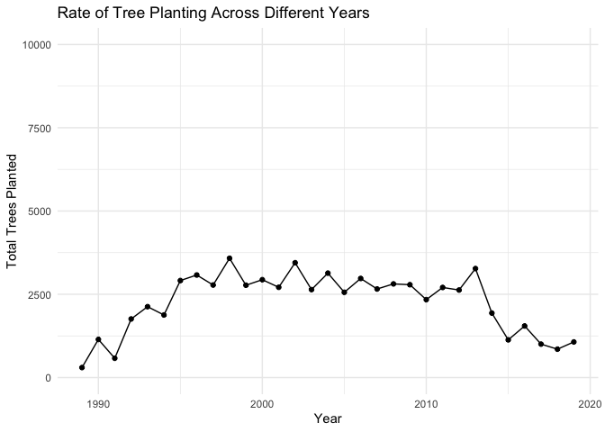
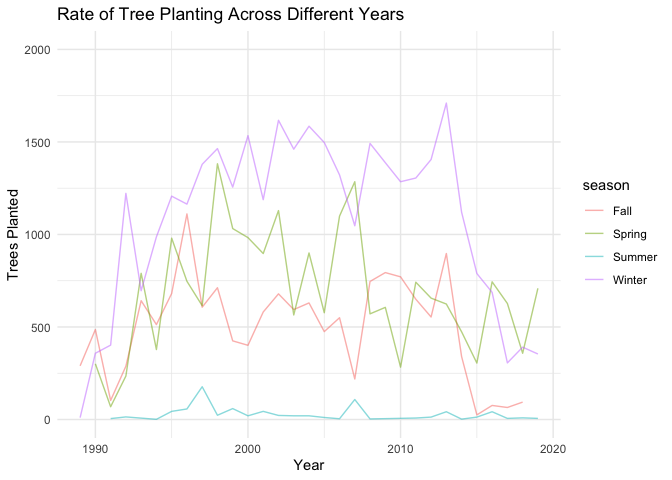
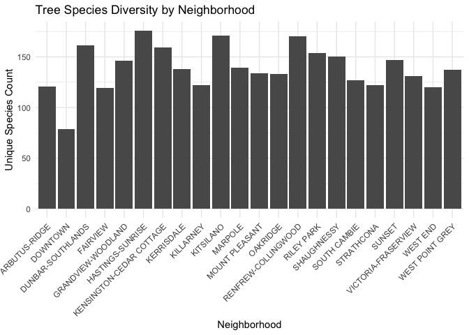
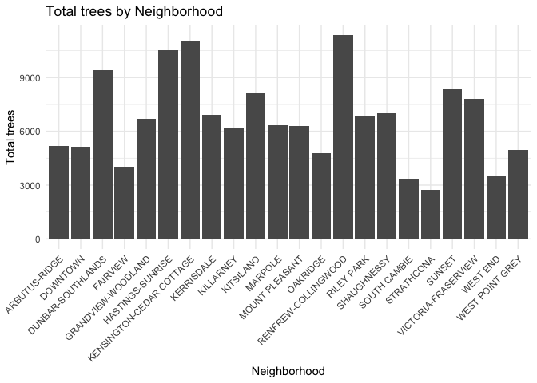
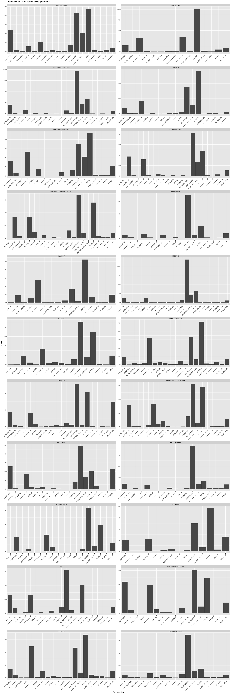
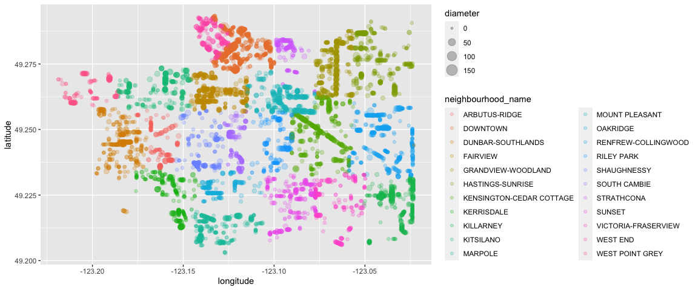
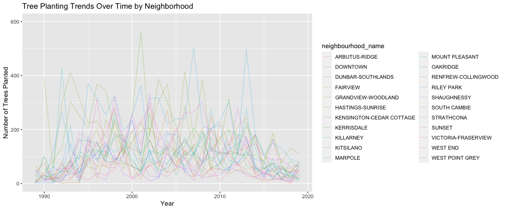

Mini Data Analysis Milestone 2
================

*To complete this milestone, you can either edit [this `.rmd`
file](https://raw.githubusercontent.com/UBC-STAT/stat545.stat.ubc.ca/master/content/mini-project/mini-project-2.Rmd)
directly. Fill in the sections that are commented out with
`<!--- start your work here--->`. When you are done, make sure to knit
to an `.md` file by changing the output in the YAML header to
`github_document`, before submitting a tagged release on canvas.*

# Welcome to the rest of your mini data analysis project!

In Milestone 1, you explored your data. and came up with research
questions. This time, we will finish up our mini data analysis and
obtain results for your data by:

- Making summary tables and graphs
- Manipulating special data types in R: factors and/or dates and times.
- Fitting a model object to your data, and extract a result.
- Reading and writing data as separate files.

We will also explore more in depth the concept of *tidy data.*

**NOTE**: The main purpose of the mini data analysis is to integrate
what you learn in class in an analysis. Although each milestone provides
a framework for you to conduct your analysis, it’s possible that you
might find the instructions too rigid for your data set. If this is the
case, you may deviate from the instructions – just make sure you’re
demonstrating a wide range of tools and techniques taught in this class.

# Instructions

**To complete this milestone**, edit [this very `.Rmd`
file](https://raw.githubusercontent.com/UBC-STAT/stat545.stat.ubc.ca/master/content/mini-project/mini-project-2.Rmd)
directly. Fill in the sections that are tagged with
`<!--- start your work here--->`.

**To submit this milestone**, make sure to knit this `.Rmd` file to an
`.md` file by changing the YAML output settings from
`output: html_document` to `output: github_document`. Commit and push
all of your work to your mini-analysis GitHub repository, and tag a
release on GitHub. Then, submit a link to your tagged release on canvas.

**Points**: This milestone is worth 50 points: 45 for your analysis, and
5 for overall reproducibility, cleanliness, and coherence of the Github
submission.

**Research Questions**: In Milestone 1, you chose two research questions
to focus on. Wherever realistic, your work in this milestone should
relate to these research questions whenever we ask for justification
behind your work. In the case that some tasks in this milestone don’t
align well with one of your research questions, feel free to discuss
your results in the context of a different research question.

# Learning Objectives

By the end of this milestone, you should:

- Understand what *tidy* data is, and how to create it using `tidyr`.
- Generate a reproducible and clear report using R Markdown.
- Manipulating special data types in R: factors and/or dates and times.
- Fitting a model object to your data, and extract a result.
- Reading and writing data as separate files.

# Setup

Begin by loading your data and the tidyverse package below:

``` r
library(datateachr) 
library(tidyverse)
```

# Task 1: Process and summarize your data

From milestone 1, you should have an idea of the basic structure of your
dataset (e.g. number of rows and columns, class types, etc.). Here, we
will start investigating your data more in-depth using various data
manipulation functions.

### 1.1 (1 point)

First, write out the 4 research questions you defined in milestone 1
were. This will guide your work through milestone 2:

<!-------------------------- Start your work below ---------------------------->

1.  **How has the rate of tree planting changed across years?**
2.  **How does tree planting correlate with seasonality? Are more trees
    planted in certain months or seasons?**
3.  **Are some neighborhoods more diverse in their range of tree species
    than others?**
4.  **Are certain tree species more prevalent in specific
    neighborhoods?**
    <!----------------------------------------------------------------------------->

Here, we will investigate your data using various data manipulation and
graphing functions.

### 1.2 (8 points)

Now, for each of your four research questions, choose one task from
options 1-4 (summarizing), and one other task from 4-8 (graphing). You
should have 2 tasks done for each research question (8 total). Make sure
it makes sense to do them! (e.g. don’t use a numerical variables for a
task that needs a categorical variable.). Comment on why each task helps
(or doesn’t!) answer the corresponding research question.

Ensure that the output of each operation is printed!

Also make sure that you’re using dplyr and ggplot2 rather than base R.
Outside of this project, you may find that you prefer using base R
functions for certain tasks, and that’s just fine! But part of this
project is for you to practice the tools we learned in class, which is
dplyr and ggplot2.

**Summarizing:**

1.  Compute the *range*, *mean*, and *two other summary statistics* of
    **one numerical variable** across the groups of **one categorical
    variable** from your data.
2.  Compute the number of observations for at least one of your
    categorical variables. Do not use the function `table()`!
3.  Create a categorical variable with 3 or more groups from an existing
    numerical variable. You can use this new variable in the other
    tasks! *An example: age in years into “child, teen, adult, senior”.*
4.  Compute the proportion and counts in each category of one
    categorical variable across the groups of another categorical
    variable from your data. Do not use the function `table()`!

**Graphing:**

6.  Create a graph of your choosing, make one of the axes logarithmic,
    and format the axes labels so that they are “pretty” or easier to
    read.
7.  Make a graph where it makes sense to customize the alpha
    transparency.

Using variables and/or tables you made in one of the “Summarizing”
tasks:

8.  Create a graph that has at least two geom layers.
9.  Create 3 histograms, with each histogram having different sized
    bins. Pick the “best” one and explain why it is the best.

Make sure it’s clear what research question you are doing each operation
for!

<!------------------------- Start your work below ----------------------------->

## **How has the rate of tree planting changed across years?**

To address this question, we will begin by computing the range, mean,
standard deviation and median overall rate of tree planting (trees
planted per year) in the `vancouver_trees` data set (task 1). This will
give me an understanding of the overall rate of tree planting, following
which we will plot a graph of rate of tree planting per year to see
which years was planting more successful than others. This graph will
have at least two geom layers to indicate both the individual year’s
planting rate (geom_point()) as well as the trend in planting rate over
time (geom_line()) (task 8).

#### Summarizing:

``` r
   tree_planting_by_year <- vancouver_trees %>%
      mutate(year_planted = year(date_planted)) %>%
      group_by(year_planted) %>%
      filter(!is.na(year_planted)) %>% 
      summarize(total_trees = n())

  tree_planting_by_year 
```

    ## # A tibble: 31 × 2
    ##    year_planted total_trees
    ##           <dbl>       <int>
    ##  1         1989         300
    ##  2         1990        1145
    ##  3         1991         579
    ##  4         1992        1759
    ##  5         1993        2128
    ##  6         1994        1879
    ##  7         1995        2912
    ##  8         1996        3079
    ##  9         1997        2778
    ## 10         1998        3581
    ## # ℹ 21 more rows

``` r
  summary_stats <-  tree_planting_by_year %>%
                    summarize(
                      range_min = min(total_trees),
                      range_max = max(total_trees),
                      mean_planting_rate = mean(total_trees),
                      sd_planting_rate = sd(total_trees),
                      median_planting_rate = median(total_trees)
                      )

  summary_stats #display the summary statistics
```

    ## # A tibble: 1 × 5
    ##   range_min range_max mean_planting_rate sd_planting_rate median_planting_rate
    ##       <int>     <int>              <dbl>            <dbl>                <int>
    ## 1       300      3581              2260.             899.                 2640

### Graphing:

``` r
  ggplot(tree_planting_by_year, aes(x = year_planted, y = total_trees)) +
    geom_line() +
    geom_point() +
    xlab("Year") +
    ylab("Total Trees Planted") +
    ggtitle("Rate of Tree Planting Across Different Years") +
    theme_minimal() +
    coord_cartesian(ylim = c(0, 10000))
```

<!-- -->

## **How does tree planting correlate with seasonality? Are more trees planted in certain months or seasons?**

To address this question, we will begin by creating a “season variable
(categorical) (task 3). I will be extracting month information from the
`date_planted` variable in the `vancouver_trees` data set and have
defined the seasons as listed in the table below:

| Number | Month     | Season |
|--------|-----------|--------|
| 1      | January   | Winter |
| 2      | February  | Winter |
| 3      | March     | Spring |
| 4      | April     | Spring |
| 5      | May       | Spring |
| 6      | June      | Summer |
| 7      | July      | Summer |
| 8      | August    | Summer |
| 9      | September | Fall   |
| 10     | October   | Fall   |
| 11     | November  | Fall   |
| 12     | December  | Winter |

We will then graph the number of trees planted per year, using separate
lines for each season and customizing the alpha transparency so that the
patterns in tree planting trends per season are more easily visualized
(task 7).

### Summarizing:

``` r
#creating a new "season" column
#the Spring, Summer, Fall or Winter label is assigned to each row (tree) based on the month it was planted
trees_planted_by_year <- vancouver_trees %>%
  filter(!is.na(date_planted)) %>% 
  mutate(month_planted = month(date_planted),
         season = case_when(month_planted %in% c(3, 4, 5) ~ "Spring",
                            month_planted %in% c(6, 7, 8) ~ "Summer",
                            month_planted %in% c(9, 10, 11) ~ "Fall",
                            month_planted %in% c(12, 1, 2) ~ "Winter", 
                            TRUE ~ "Unknown")) %>%
  mutate(year_planted = year(date_planted)) %>%
  group_by(season, year_planted) %>%
  summarize(total_trees = n())
```

    ## `summarise()` has grouped output by 'season'. You can override using the
    ## `.groups` argument.

``` r
  trees_planted_by_year
```

    ## # A tibble: 117 × 3
    ## # Groups:   season [4]
    ##    season year_planted total_trees
    ##    <chr>         <dbl>       <int>
    ##  1 Fall           1989         290
    ##  2 Fall           1990         486
    ##  3 Fall           1991         103
    ##  4 Fall           1992         288
    ##  5 Fall           1993         642
    ##  6 Fall           1994         513
    ##  7 Fall           1995         681
    ##  8 Fall           1996        1111
    ##  9 Fall           1997         607
    ## 10 Fall           1998         712
    ## # ℹ 107 more rows

### Graphing:

``` r
  trees_planted_by_year %>%
    ggplot(aes(year_planted, total_trees)) +
    geom_line(aes(colour = season), alpha = 0.5) +
    xlab("Year") +
    ylab("Trees Planted") +
    ggtitle("Rate of Tree Planting Across Different Years") +
    theme_minimal() +
    coord_cartesian(ylim = c(0, 2000))
```

<!-- -->

In the graph above, we can see that across the years it is most common
for majority of trees to be planted in the Winter season. However, there
is an interesting decreasing trend of trees planted in the winter since
2013 - perhaps, this may be due to more severe and colder winters over
more recent years. This could be worth exploring in the future.

## **Are some neighborhoods more diverse in their range of tree species than others?**

First we will compute the number of unique tree species and number of
total trees in each neighbourhood (task 2). We will also calculate a
diversity ratio defined by the number of unique tree species divided by
the number of total trees per neighbourhood. Then, we will graph
different bar charts to show these trends and ensure the theme and axes
are adjusted to make the charts readable and pretty (task 6).

### Summarizing:

``` r
  #Counting unique species and total trees per neighborhood:
  tree_diversity_per_neighborhood <- vancouver_trees %>%
    group_by(neighbourhood_name) %>%  
    summarise(unique_species = n_distinct(species_name), total_trees_per_neighbourhood = n(), diversity_ratio = unique_species / total_trees_per_neighbourhood * 100)

    tree_diversity_per_neighborhood
```

    ## # A tibble: 22 × 4
    ##    neighbourhood_name      unique_species total_trees_per_neig…¹ diversity_ratio
    ##    <chr>                            <int>                  <int>           <dbl>
    ##  1 ARBUTUS-RIDGE                      121                   5169            2.34
    ##  2 DOWNTOWN                            79                   5159            1.53
    ##  3 DUNBAR-SOUTHLANDS                  161                   9415            1.71
    ##  4 FAIRVIEW                           119                   4002            2.97
    ##  5 GRANDVIEW-WOODLAND                 146                   6703            2.18
    ##  6 HASTINGS-SUNRISE                   176                  10547            1.67
    ##  7 KENSINGTON-CEDAR COTTA…            159                  11042            1.44
    ##  8 KERRISDALE                         138                   6936            1.99
    ##  9 KILLARNEY                          122                   6148            1.98
    ## 10 KITSILANO                          171                   8115            2.11
    ## # ℹ 12 more rows
    ## # ℹ abbreviated name: ¹​total_trees_per_neighbourhood

### Graphing:

``` r
  ggplot(tree_diversity_per_neighborhood, aes(x = neighbourhood_name, y = unique_species)) +
  geom_bar(stat="identity") +
  theme_minimal() +
  labs(title = "Tree Species Diversity by Neighborhood",
       x = "Neighborhood",
       y = "Unique Species Count") +
  theme(axis.text.x = element_text(angle = 45, hjust = 1))
```

<!-- -->

``` r
  ggplot(tree_diversity_per_neighborhood, aes(x = neighbourhood_name, y = total_trees_per_neighbourhood)) +
    geom_bar(stat = "identity") +
    theme_minimal() +
    labs(title = "Total trees by Neighborhood",
         x = "Neighborhood",
         y = "Total trees") +
    theme(axis.text.x = element_text(angle = 45, hjust = 1))
```

<!-- -->

``` r
   ggplot(tree_diversity_per_neighborhood, aes(x = neighbourhood_name, y = diversity_ratio)) +
    geom_bar(stat = "identity") +
    theme_minimal() +
    labs(title = "Diversity ratio by Neighborhood",
         x = "Neighborhood",
         y = "Ratio of unique species to total trees") +
    theme(axis.text.x = element_text(angle = 45, hjust = 1))
```

<!-- -->

## **Are certain tree species more prevalent in specific neighborhoods?**

To answer this question we will focus on understanding the prevalence of
Maple tree species (Acer genus) in different neighbourhoods as the full
`vancouver_trees` data set is rather large and we were focusing
milestone 1 on maple trees as well. I will first compute the number of
Acer trees in each species across the different neighbourhoods (task 2).
I will then plot these data in separate bar charts for each
neighbourhood. To visualize certain species of Maple tree across
Vancouver neighbourhood, I will also plot these trees on a location map
(longitude vs latitude) and adjust the alpha transparency to make sure
it is readable (task 7).

### Summarizing:

``` r
 # Group by neighborhood and tree species to count the number of each species in each neighborhood
  species_by_neighborhood <- vancouver_trees %>%
    filter(!is.na(neighbourhood_name) & !is.na(genus_name) & genus_name == "ACER") %>%  # Remove rows where either of these is NA
    group_by(neighbourhood_name, species_name) %>%  
    summarise(count = n())  # count occurences
```

    ## `summarise()` has grouped output by 'neighbourhood_name'. You can override
    ## using the `.groups` argument.

``` r
  species_by_neighborhood
```

    ## # A tibble: 420 × 3
    ## # Groups:   neighbourhood_name [22]
    ##    neighbourhood_name species_name count
    ##    <chr>              <chr>        <int>
    ##  1 ARBUTUS-RIDGE      CAMPESTRE      120
    ##  2 ARBUTUS-RIDGE      CAPPADOCICUM     8
    ##  3 ARBUTUS-RIDGE      CIRCINATUM       1
    ##  4 ARBUTUS-RIDGE      FREEMANI   X    29
    ##  5 ARBUTUS-RIDGE      GINNALA          5
    ##  6 ARBUTUS-RIDGE      GRISEUM         52
    ##  7 ARBUTUS-RIDGE      JAPONICUM        1
    ##  8 ARBUTUS-RIDGE      MACROPHYLLUM    10
    ##  9 ARBUTUS-RIDGE      NEGUNDO          4
    ## 10 ARBUTUS-RIDGE      NIGRUM           3
    ## # ℹ 410 more rows

``` r
  vancouver_trees
```

    ## # A tibble: 146,611 × 20
    ##    tree_id civic_number std_street    genus_name species_name cultivar_name  
    ##      <dbl>        <dbl> <chr>         <chr>      <chr>        <chr>          
    ##  1  149556          494 W 58TH AV     ULMUS      AMERICANA    BRANDON        
    ##  2  149563          450 W 58TH AV     ZELKOVA    SERRATA      <NA>           
    ##  3  149579         4994 WINDSOR ST    STYRAX     JAPONICA     <NA>           
    ##  4  149590          858 E 39TH AV     FRAXINUS   AMERICANA    AUTUMN APPLAUSE
    ##  5  149604         5032 WINDSOR ST    ACER       CAMPESTRE    <NA>           
    ##  6  149616          585 W 61ST AV     PYRUS      CALLERYANA   CHANTICLEER    
    ##  7  149617         4909 SHERBROOKE ST ACER       PLATANOIDES  COLUMNARE      
    ##  8  149618         4925 SHERBROOKE ST ACER       PLATANOIDES  COLUMNARE      
    ##  9  149619         4969 SHERBROOKE ST ACER       PLATANOIDES  COLUMNARE      
    ## 10  149625          720 E 39TH AV     FRAXINUS   AMERICANA    AUTUMN APPLAUSE
    ## # ℹ 146,601 more rows
    ## # ℹ 14 more variables: common_name <chr>, assigned <chr>, root_barrier <chr>,
    ## #   plant_area <chr>, on_street_block <dbl>, on_street <chr>,
    ## #   neighbourhood_name <chr>, street_side_name <chr>, height_range_id <dbl>,
    ## #   diameter <dbl>, curb <chr>, date_planted <date>, longitude <dbl>,
    ## #   latitude <dbl>

### Graphing:

``` r
    # Plotting this information:
    ggplot(species_by_neighborhood, aes(x = species_name, y = count)) +
      geom_bar(stat = "identity") +
      facet_wrap(~ neighbourhood_name, scales = "free", ncol = 2) +  
      xlab("Tree Species") +
      ylab("Count") +
      ggtitle("Prevalence of Tree Species by Neighborhood") +
      theme(axis.text.x = element_text(angle = 45, hjust = 1))
```

<!-- -->

As I described above, it would also be interesting to graph the
distribution of Maple trees (Acer genus) in a visual manner. Let’s use
longitude and latitude information of each tree to do so. For the
purpose of this exercise, let’s focus on Acer rubrum (Red Maple tree) as
we can see in the plots above that they are a fairly common species of
Maple tree across all Vancouver neighbourhoods.

``` r
  # In this graph, we will colour by neighbourhood_name and use size of the point to reflect the tree diameter
  vancouver_trees %>%
    filter(genus_name == "ACER", species_name == "RUBRUM") %>%
    ggplot(aes(x = longitude, y = latitude)) +
    geom_point(aes(colour = neighbourhood_name, size = diameter), alpha = 0.25)
```

    ## Warning: Removed 1667 rows containing missing values (`geom_point()`).

<!-- -->

From the first milestone assignment (MDA1), we learned that Acer rubrum
and Acer platanoides are the most prevalent types of Maple trees in
Vancouver neighbourhoods. Let’s also plot these visually on the
longitude vs latitude graph:

``` r
  # Let's plot these two tree types and colour by tree species to visualize their distribution as we did above:
  vancouver_trees %>%
    filter(genus_name == "ACER", species_name == "RUBRUM"| species_name == "PLATANOIDES") %>%
    ggplot(aes(x = longitude, y = latitude)) +
    geom_point(aes(colour = species_name, size = diameter), alpha = 0.25)
```

    ## Warning: Removed 3041 rows containing missing values (`geom_point()`).

<!-- -->

Interesting, we see more Acer rubrum trees on the west side of Vancouver
while there are more Acer platanoides on the east side. I wonder whether
this is due to soil conditions or a different factor.

<!----------------------------------------------------------------------------->

### 1.3 (2 points)

Based on the operations that you’ve completed, how much closer are you
to answering your research questions? Think about what aspects of your
research questions remain unclear. Can your research questions be
refined, now that you’ve investigated your data a bit more? Which
research questions are yielding interesting results?

<!------------------------- Write your answer here ---------------------------->

The first two questions have been fully addressed: (1) by visualizing
the trends in total tree planting in Vancouver across years, we noticed
a drop in tree planting after 2013 and (2) by plotting the relationship
between seasonality and tree planting, we learned that generally trees
are planted in the Winter months in Vancouver which is interesting and
likely different across Canada, especially in areas such as Alberta
where it snows and the ground tends to freeze over. This is cool!

The remaining two questions explored tree diversity and distribution
across various Vancouver neighbourhoods. While we have begun to get an
understanding of tree diversity and the distribution of Maple trees
(Acer genus) across Vancouver, there are more neighbourhood specific
patterns we can explore - such as which neighbourhoods have the largest
trees, which plant the most trees, etc.

<!----------------------------------------------------------------------------->

# Task 2: Tidy your data

In this task, we will do several exercises to reshape our data. The goal
here is to understand how to do this reshaping with the `tidyr` package.

A reminder of the definition of *tidy* data:

- Each row is an **observation**
- Each column is a **variable**
- Each cell is a **value**

### 2.1 (2 points)

Based on the definition above, can you identify if your data is tidy or
untidy? Go through all your columns, or if you have \>8 variables, just
pick 8, and explain whether the data is untidy or tidy.

<!--------------------------- Start your work below --------------------------->

The `vancouver_trees` data set contains tidy data as each row represents
one tree (observation), each column is a variable by which to describe
this tree and each cell contains just one value. Refer to the list below
for a description of why 8 randomly selected variables from this data
set demonstrate that the data is tidy:

- `tree_id` - a quantitative variable, each indexed row (tree
  observation is assigned a specific numeric value to serve as a tree
  identifier
- `genus_name` - a character variable, each indexed row (tree
  observation) is assigned to a specific genus name
- `species_name` - a character variable, each indexed row (tree
  observation) is assigned to a specific species name
- `on_street` - a character variable, each indexed row (tree
  observation) is associated with a specific street
- `neighbourhood_name` - a character variable, each indexed row (tree
  observation) is located in a specific neighbourhood
- `height_range_id` - a numeric variable, each indexed row (tree
  observation) is assigned a height ID
- `diameter` - a numeric variable, each indexed row (tree observation)
  has a defined tree diameter
- `date_planted` - a date variable, each indexed row (tree observation)
  has a specific date on which the tree was planted

<!----------------------------------------------------------------------------->

### 2.2 (4 points)

Now, if your data is tidy, untidy it! Then, tidy it back to it’s
original state.

If your data is untidy, then tidy it! Then, untidy it back to it’s
original state.

Be sure to explain your reasoning for this task. Show us the “before”
and “after”.

<!--------------------------- Start your work below --------------------------->

We will use the pivot_wider function to untidy this data set. I am
particularly interested in investigating neighbourhood specific patterns
in tree planting, such as the tree type differences across Vancouver
communities. To transform `vancouver_trees` into untidy data to address
this question, we will begin by grouping by neighbourhood_name and
summarizing the number of each tree type (using common_name of trees
here) in each neighbourhood. As you can see below, now each row
represents a unique neighbourhood name and there is a new column for
each common tree name containing the number of that specific tree in the
neighbourhood. **This makes the data untidy since each row now holds
combined counts of multiple trees (no longer one observation per row).**

``` r
  untidy_data_wider <- vancouver_trees %>%
    group_by(neighbourhood_name, common_name) %>%
    summarize(count = n(), .groups = 'drop') %>%
    pivot_wider(names_from = common_name, values_from = count, values_fill = 0)

  untidy_data_wider
```

    ## # A tibble: 22 × 635
    ##    neighbourhood_name       `ACCOLADE CHERRY` `AKEBONO FLOWERING CHERRY`
    ##    <chr>                                <int>                      <int>
    ##  1 ARBUTUS-RIDGE                            1                         61
    ##  2 DOWNTOWN                                 6                          8
    ##  3 DUNBAR-SOUTHLANDS                        0                        234
    ##  4 FAIRVIEW                                 2                         41
    ##  5 GRANDVIEW-WOODLAND                       3                         90
    ##  6 HASTINGS-SUNRISE                        30                        199
    ##  7 KENSINGTON-CEDAR COTTAGE                 0                        122
    ##  8 KERRISDALE                               4                        160
    ##  9 KILLARNEY                                0                         48
    ## 10 KITSILANO                                4                         89
    ## # ℹ 12 more rows
    ## # ℹ 632 more variables: `ALDERLEAFED MOUNTAIN ASH` <int>,
    ## #   `ALIA'S MAGNOLIA` <int>, `AMERICAN ELM` <int>, `AMERICAN FILBERT` <int>,
    ## #   `AMERICAN HORNBEAM` <int>, `AMERICAN MOUNTAIN ASH` <int>,
    ## #   `AMERICAN SWEETGUM` <int>, `AMUR MAPLE` <int>, `APPLE SERVICEBERRY` <int>,
    ## #   `APPLE SPECIES` <int>, `APPRICOT PLUM` <int>, `ARISTOCRAT PEAR` <int>,
    ## #   `ARMSTRONG RED MAPLE` <int>, `ARNOLD TULIPTREE` <int>, …

Now, to tidy the data set again, we will use the pivot_longer function.
**This transforms the untidy dataset back into a tidy format**, where
each row represents a unique observation characterized by
neighbourhood_name, common_name and a count variable that lists the
number of trees of each type in that neighbourhood.

``` r
    tidy_data <- untidy_data_wider %>%
      pivot_longer(cols = -neighbourhood_name, 
                   names_to = "common_name", 
                   values_to = "count") %>%
      filter(count > 0)
    
    tidy_data
```

    ## # A tibble: 6,141 × 3
    ##    neighbourhood_name common_name              count
    ##    <chr>              <chr>                    <int>
    ##  1 ARBUTUS-RIDGE      ACCOLADE CHERRY              1
    ##  2 ARBUTUS-RIDGE      AKEBONO FLOWERING CHERRY    61
    ##  3 ARBUTUS-RIDGE      ALDERLEAFED MOUNTAIN ASH     8
    ##  4 ARBUTUS-RIDGE      ALIA'S MAGNOLIA              3
    ##  5 ARBUTUS-RIDGE      AMERICAN ELM                92
    ##  6 ARBUTUS-RIDGE      AMERICAN FILBERT             4
    ##  7 ARBUTUS-RIDGE      AMERICAN HORNBEAM           14
    ##  8 ARBUTUS-RIDGE      AMERICAN MOUNTAIN ASH        8
    ##  9 ARBUTUS-RIDGE      AMERICAN SWEETGUM            2
    ## 10 ARBUTUS-RIDGE      AMUR MAPLE                   5
    ## # ℹ 6,131 more rows

<!----------------------------------------------------------------------------->

### 2.3 (4 points)

Now, you should be more familiar with your data, and also have made
progress in answering your research questions. Based on your interest,
and your analyses, pick 2 of the 4 research questions to continue your
analysis in the remaining tasks:

<!-------------------------- Start your work below ---------------------------->

1.  **Which neighbourhood planted the most and least number of trees?**

2.  **How have the neighbourhood-specific tree planting trends changed
    over time?**

<!----------------------------------------------------------------------------->

Explain your decision for choosing the above two research questions.

<!--------------------------- Start your work below --------------------------->

I chose the above two research questions as we learned in the initial
analysis in task 1 that the trends in tree planting have decreased in
recent years (a decrease in number of trees planted per year since
2013). I would like to understand if this is neighbourhood-specific or a
general trend across all neighbourhoods in Vancouver.

<!----------------------------------------------------------------------------->

Now, try to choose a version of your data that you think will be
appropriate to answer these 2 questions. Use between 4 and 8 functions
that we’ve covered so far (i.e. by filtering, cleaning, tidy’ing,
dropping irrelevant columns, etc.).

(If it makes more sense, then you can make/pick two versions of your
data, one for each research question.)

<!--------------------------- Start your work below --------------------------->

## Question 1: Which neighbourhood planted the most number of trees?

``` r
  #Identify the neighbourhood with the most and least trees
  tree_count_arranged <- vancouver_trees %>%
  filter(!is.na(neighbourhood_name)) %>% #filter out missing values
  group_by(neighbourhood_name) %>% 
  summarize(tree_count = n()) %>% #drop irrelevant columns, only retain neighbourhood_name and tree_count
  arrange(tree_count) #arranges rows from lowest to highest tree count

  print(tree_count_arranged) 
```

    ## # A tibble: 22 × 2
    ##    neighbourhood_name tree_count
    ##    <chr>                   <int>
    ##  1 STRATHCONA               2724
    ##  2 SOUTH CAMBIE             3343
    ##  3 WEST END                 3507
    ##  4 FAIRVIEW                 4002
    ##  5 OAKRIDGE                 4796
    ##  6 WEST POINT GREY          4939
    ##  7 DOWNTOWN                 5159
    ##  8 ARBUTUS-RIDGE            5169
    ##  9 KILLARNEY                6148
    ## 10 MOUNT PLEASANT           6292
    ## # ℹ 12 more rows

``` r
  #top row is the neighbourhood with least trees planted
  #last row is the neighbourhood with the most trees planted
```

## Question 2: How have these trends changed over time?

``` r
  vancouver_trees
```

    ## # A tibble: 146,611 × 20
    ##    tree_id civic_number std_street    genus_name species_name cultivar_name  
    ##      <dbl>        <dbl> <chr>         <chr>      <chr>        <chr>          
    ##  1  149556          494 W 58TH AV     ULMUS      AMERICANA    BRANDON        
    ##  2  149563          450 W 58TH AV     ZELKOVA    SERRATA      <NA>           
    ##  3  149579         4994 WINDSOR ST    STYRAX     JAPONICA     <NA>           
    ##  4  149590          858 E 39TH AV     FRAXINUS   AMERICANA    AUTUMN APPLAUSE
    ##  5  149604         5032 WINDSOR ST    ACER       CAMPESTRE    <NA>           
    ##  6  149616          585 W 61ST AV     PYRUS      CALLERYANA   CHANTICLEER    
    ##  7  149617         4909 SHERBROOKE ST ACER       PLATANOIDES  COLUMNARE      
    ##  8  149618         4925 SHERBROOKE ST ACER       PLATANOIDES  COLUMNARE      
    ##  9  149619         4969 SHERBROOKE ST ACER       PLATANOIDES  COLUMNARE      
    ## 10  149625          720 E 39TH AV     FRAXINUS   AMERICANA    AUTUMN APPLAUSE
    ## # ℹ 146,601 more rows
    ## # ℹ 14 more variables: common_name <chr>, assigned <chr>, root_barrier <chr>,
    ## #   plant_area <chr>, on_street_block <dbl>, on_street <chr>,
    ## #   neighbourhood_name <chr>, street_side_name <chr>, height_range_id <dbl>,
    ## #   diameter <dbl>, curb <chr>, date_planted <date>, longitude <dbl>,
    ## #   latitude <dbl>

``` r
  # Create another table containing the number of trees planted each year in each neighborhood
  trees_over_time <- vancouver_trees %>%
    mutate(year_planted = year(date_planted)) %>% 
    group_by(year_planted, neighbourhood_name) %>% 
    summarize(tree_count = n()) #only retain year_planted, neighbourhood_name and tree_count columns
```

    ## `summarise()` has grouped output by 'year_planted'. You can override using the
    ## `.groups` argument.

``` r
  print(trees_over_time)
```

    ## # A tibble: 693 × 3
    ## # Groups:   year_planted [32]
    ##    year_planted neighbourhood_name       tree_count
    ##           <dbl> <chr>                         <int>
    ##  1         1989 ARBUTUS-RIDGE                    41
    ##  2         1989 DOWNTOWN                          6
    ##  3         1989 DUNBAR-SOUTHLANDS                65
    ##  4         1989 GRANDVIEW-WOODLAND               26
    ##  5         1989 KENSINGTON-CEDAR COTTAGE          7
    ##  6         1989 KERRISDALE                        2
    ##  7         1989 KILLARNEY                        30
    ##  8         1989 MARPOLE                           6
    ##  9         1989 MOUNT PLEASANT                    4
    ## 10         1989 RENFREW-COLLINGWOOD              45
    ## # ℹ 683 more rows

``` r
   # Plotting the trend over time
    ggplot(trees_over_time, aes(x = year_planted, y = tree_count, color = neighbourhood_name)) +
      geom_line(alpha = 0.25) +
      ggtitle("Tree Planting Trends Over Time by Neighborhood") +
      xlab("Year") +
      ylab("Number of Trees Planted") +
      coord_cartesian(ylim = c(0, 600))
```

    ## Warning: Removed 22 rows containing missing values (`geom_line()`).

<!-- -->

# Task 3: Modelling

## 3.0 (no points)

Pick a research question from 1.2, and pick a variable of interest
(we’ll call it “Y”) that’s relevant to the research question. Indicate
these.

<!-------------------------- Start your work below ---------------------------->

**Research Question**: How has the rate of tree planting in different
neighbourhoods changed across years?

**Variable of interest**: Number of Trees Planted (tree_count)

<!----------------------------------------------------------------------------->

## 3.1 (3 points)

Fit a model or run a hypothesis test that provides insight on this
variable with respect to the research question. Store the model object
as a variable, and print its output to screen. We’ll omit having to
justify your choice, because we don’t expct you to know about model
specifics in STAT 545.

- **Note**: It’s OK if you don’t know how these models/tests work. Here
  are some examples of things you can do here, but the sky’s the limit.

  - You could fit a model that makes predictions on Y using another
    variable, by using the `lm()` function.
  - You could test whether the mean of Y equals 0 using `t.test()`, or
    maybe the mean across two groups are different using `t.test()`, or
    maybe the mean across multiple groups are different using `anova()`
    (you may have to pivot your data for the latter two).
  - You could use `lm()` to test for significance of regression
    coefficients.

<!-------------------------- Start your work below ---------------------------->

``` r
  trees_per_year_fairview <- vancouver_trees %>%
    mutate(year_planted = year(date_planted)) %>%
    filter(!is.na(year_planted) & neighbourhood_name == "FAIRVIEW") %>%
    group_by(year_planted) %>%
    summarise(tree_count = n()) %>%
    arrange(year_planted)

  trees_per_year_fairview
```

    ## # A tibble: 30 × 2
    ##    year_planted tree_count
    ##           <dbl>      <int>
    ##  1         1990         60
    ##  2         1991         14
    ##  3         1992          1
    ##  4         1993          4
    ##  5         1994          3
    ##  6         1995         97
    ##  7         1996         64
    ##  8         1997         67
    ##  9         1998         73
    ## 10         1999         75
    ## # ℹ 20 more rows

``` r
  model <- lm(tree_count ~ year_planted, data = trees_per_year_fairview)
  
  # Print the output of the model
  summary(model)
```

    ## 
    ## Call:
    ## lm(formula = tree_count ~ year_planted, data = trees_per_year_fairview)
    ## 
    ## Residuals:
    ##     Min      1Q  Median      3Q     Max 
    ## -51.929 -22.747   2.453  16.237  82.489 
    ## 
    ## Coefficients:
    ##               Estimate Std. Error t value Pr(>|t|)
    ## (Intercept)   976.4722  1447.7911   0.674    0.506
    ## year_planted   -0.4636     0.7223  -0.642    0.526
    ## 
    ## Residual standard error: 34.24 on 28 degrees of freedom
    ## Multiple R-squared:  0.0145, Adjusted R-squared:  -0.02069 
    ## F-statistic: 0.412 on 1 and 28 DF,  p-value: 0.5262

<!----------------------------------------------------------------------------->

## 3.2 (3 points)

Produce something relevant from your fitted model: either predictions on
Y, or a single value like a regression coefficient or a p-value.

- Be sure to indicate in writing what you chose to produce.
- Your code should either output a tibble (in which case you should
  indicate the column that contains the thing you’re looking for), or
  the thing you’re looking for itself.
- Obtain your results using the `broom` package if possible. If your
  model is not compatible with the broom function you’re needing, then
  you can obtain your results by some other means, but first indicate
  which broom function is not compatible.

<!-------------------------- Start your work below ---------------------------->

I am going to use the fitted model to predict how many trees will be
planted in the Fairview neighbourhood in the next three years (2024,
2025 and 2026). As shown below, the linear model predicted that
approximately 38 trees would be planted per year in the next three years
in Fairview.

``` r
    # Create a data frame with future years
    future_years <- data.frame(year_planted = c(2024, 2025, 2026))
  
    # Make predictions
    predictions <- predict(model, newdata = future_years)
  
    # Combine future years and predictions into a tibble
    future_predictions <- tibble(year_planted = future_years$year_planted, predicted_tree_count = predictions)
    
    future_predictions
```

    ## # A tibble: 3 × 2
    ##   year_planted predicted_tree_count
    ##          <dbl>                <dbl>
    ## 1         2024                 38.1
    ## 2         2025                 37.6
    ## 3         2026                 37.2

<!----------------------------------------------------------------------------->

# Task 4: Reading and writing data

Get set up for this exercise by making a folder called `output` in the
top level of your project folder / repository. You’ll be saving things
there.

## 4.1 (3 points)

Take a summary table that you made from Task 1, and write it as a csv
file in your `output` folder. Use the `here::here()` function.

- **Robustness criteria**: You should be able to move your Mini Project
  repository / project folder to some other location on your computer,
  or move this very Rmd file to another location within your project
  repository / folder, and your code should still work.
- **Reproducibility criteria**: You should be able to delete the csv
  file, and remake it simply by knitting this Rmd file.

<!-------------------------- Start your work below ---------------------------->

``` r
  #install.packages("here")
  library(here)
```

    ## here() starts at /Users/maggiechopra/Desktop/STAT545/mda-maggiechops

``` r
  write.csv(tree_diversity_per_neighborhood, here("output", "tree_diversity_per_neighborhood.csv"))
```

<!----------------------------------------------------------------------------->

## 4.2 (3 points)

Write your model object from Task 3 to an R binary file (an RDS), and
load it again. Be sure to save the binary file in your `output` folder.
Use the functions `saveRDS()` and `readRDS()`.

- The same robustness and reproducibility criteria as in 4.1 apply here.

<!-------------------------- Start your work below ---------------------------->

``` r
  saveRDS(model, here("output", "model_object.rds"))

  loaded_model <- readRDS(here("output", "model_object.rds"))
  loaded_model
```

    ## 
    ## Call:
    ## lm(formula = tree_count ~ year_planted, data = trees_per_year_fairview)
    ## 
    ## Coefficients:
    ##  (Intercept)  year_planted  
    ##     976.4722       -0.4636

<!----------------------------------------------------------------------------->

# Overall Reproducibility/Cleanliness/Coherence Checklist

Here are the criteria we’re looking for.

## Coherence (0.5 points)

The document should read sensibly from top to bottom, with no major
continuity errors.

The README file should still satisfy the criteria from the last
milestone, i.e. it has been updated to match the changes to the
repository made in this milestone.

## File and folder structure (1 points)

You should have at least three folders in the top level of your
repository: one for each milestone, and one output folder. If there are
any other folders, these are explained in the main README.

Each milestone document is contained in its respective folder, and
nowhere else.

Every level-1 folder (that is, the ones stored in the top level, like
“Milestone1” and “output”) has a `README` file, explaining in a sentence
or two what is in the folder, in plain language (it’s enough to say
something like “This folder contains the source for Milestone 1”).

## Output (1 point)

All output is recent and relevant:

- All Rmd files have been `knit`ted to their output md files.
- All knitted md files are viewable without errors on Github. Examples
  of errors: Missing plots, “Sorry about that, but we can’t show files
  that are this big right now” messages, error messages from broken R
  code
- All of these output files are up-to-date – that is, they haven’t
  fallen behind after the source (Rmd) files have been updated.
- There should be no relic output files. For example, if you were
  knitting an Rmd to html, but then changed the output to be only a
  markdown file, then the html file is a relic and should be deleted.

Our recommendation: delete all output files, and re-knit each
milestone’s Rmd file, so that everything is up to date and relevant.

## Tagged release (0.5 point)

You’ve tagged a release for Milestone 2.

### Attribution

Thanks to Victor Yuan for mostly putting this together.
